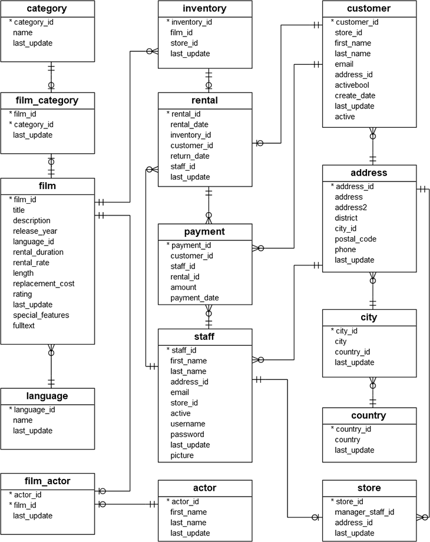
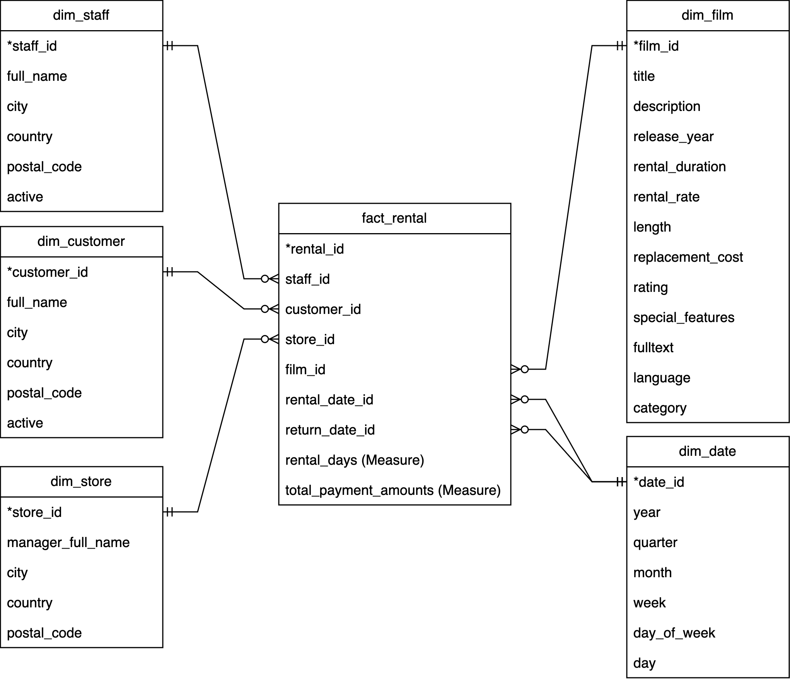

<h1>
DVD Rental ETL Pipeline with Medallion Architecture
</h1>

This project is an ETL pipeline that processes a DVD rental database stored in a PostgreSQL database, enabling it to be visualized in Google Looker Studio. The primary design patterns featured in this pipeline are **Medallion Architecture** and **Star Schema**. The Medallion Architecture design pattern enhances the data quality of the transformed data in the data warehouse, while the Star Schema simplifies data exploration and visualization process for data analysts by reducing the need for join operations.

## Architecture Diagram

&nbsp;

## Star Schema Transformation

The figures below illustrates the ER diagram of the original database and the transformed database in forms of a star schema that resides in the silver layer.

&nbsp;

## Medallion Architecture

The three layers of transformation in the ETL pipeline serve distinct purposes:

1. **Bronze Layer (Raw Data)**:  
   This layer contains raw data extracted directly from the source (e.g., Sakila database). It acts as the initial landing zone for all the data, preserving it in its original form. This layer is useful for troubleshooting or auditing purposes, ensuring no information is lost from the source during extraction.

2. **Silver Layer (Transformed Dimension and Fact Data)**:  
   In the Silver layer, the raw data undergoes cleaning, standardization, and transformation to create structured tables such as **dimension tables** (e.g., customers, films, stores) and **fact tables** (e.g., rental transactions).

3. **Gold Layer (Specific Business-Ready Data)**:  
   The Gold layer contains curated datasets tailored to specific business needs or use cases. Examples include rented film data, customer behavior insights, or weekly transaction data.

Each layer builds on the previous one to gradually transform raw data into actionable insights.